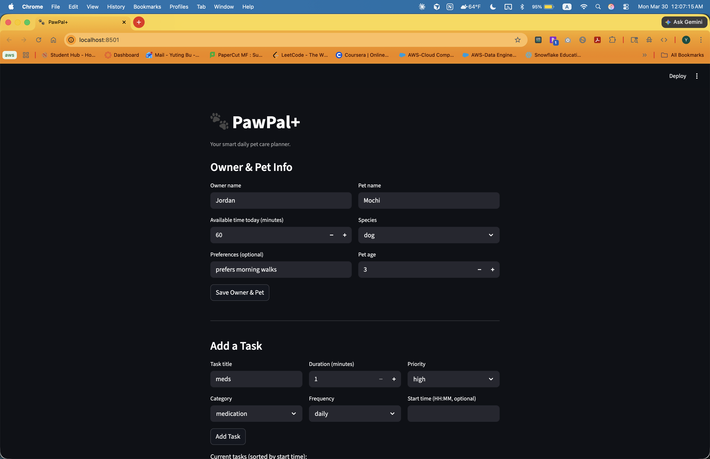
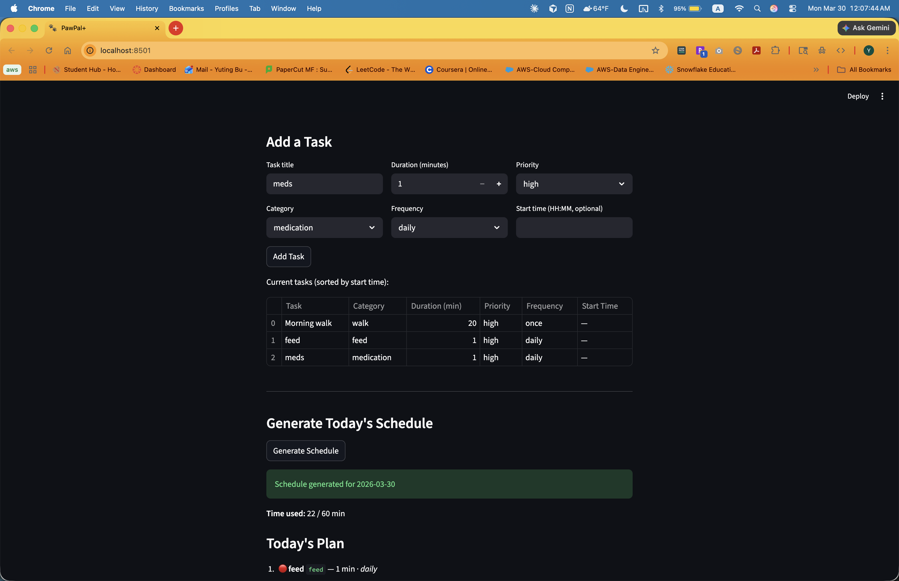
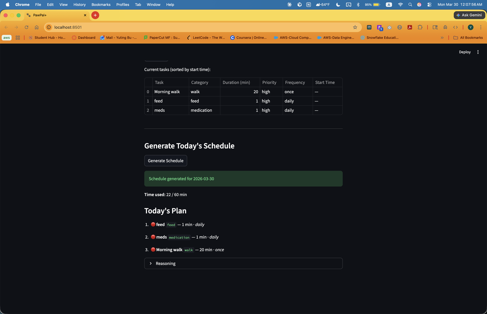
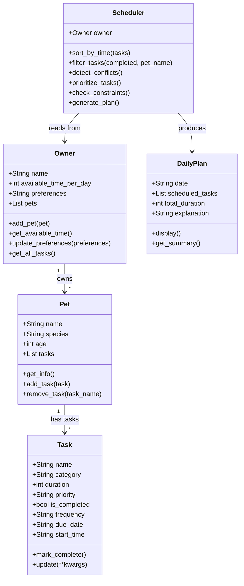

# PawPal+ (Module 2 Project)

You are building **PawPal+**, a Streamlit app that helps a pet owner plan care tasks for their pet.

## Scenario

A busy pet owner needs help staying consistent with pet care. They want an assistant that can:

- Track pet care tasks (walks, feeding, meds, enrichment, grooming, etc.)
- Consider constraints (time available, priority, owner preferences)
- Produce a daily plan and explain why it chose that plan

Your job is to design the system first (UML), then implement the logic in Python, then connect it to the Streamlit UI.

## What you will build

Your final app should:

- Let a user enter basic owner + pet info
- Let a user add/edit tasks (duration + priority at minimum)
- Generate a daily schedule/plan based on constraints and priorities
- Display the plan clearly (and ideally explain the reasoning)
- Include tests for the most important scheduling behaviors

## Demo

**Owner & Pet setup**



**Task list & schedule generation**



**Today's Plan output**



## Features

- **Owner & pet profiles** — Store the owner's name, daily time budget, and preferences alongside one or more pets.
- **Task management** — Add care tasks (walk, feed, medication, grooming, enrichment) with a duration, priority, frequency, and optional start time.
- **Priority scheduling** — The scheduler fits as many tasks as possible into the daily time budget, ordering by priority (high → medium → low) then shortest duration first.
- **Sort by time** — Tasks can be displayed in chronological HH:MM order; untimed tasks appear last.
- **Filter tasks** — Retrieve pending or completed tasks for a specific pet or across all pets.
- **Recurring tasks** — Tasks with `frequency="daily"` or `"weekly"` automatically reschedule their `due_date` when marked complete instead of disappearing.
- **Conflict detection** — The scheduler flags any two tasks sharing the same `start_time` with a clear warning before the plan is shown.
- **Reasoning display** — Every generated plan explains which tasks were scheduled, why, and which were skipped.

## Updated UML (Final)



## Testing PawPal+

Run the full test suite with:

```bash
.venv/bin/python -m pytest tests/test_pawpal.py -v
```

The suite covers 12 tests across four areas:

| Area | What is tested |
|---|---|
| **Task completion** | `mark_complete()` sets `is_completed`; `once` tasks stay done |
| **Sorting** | Tasks returned in chronological HH:MM order; untimed tasks go last |
| **Recurrence** | Daily tasks reschedule to tomorrow; weekly to next week; `is_completed` resets |
| **Conflict detection** | Duplicate `start_time` triggers a warning; unique times and no-time tasks are safe |
| **Edge cases** | Empty pet task list returns an empty plan; tasks exceeding the time budget are skipped |

**Confidence level: ★★★★☆** — Core scheduling behaviors are well covered. Not yet tested: multi-pet conflict detection across pets, preference-based ordering, or UI integration.

## Getting started

### Setup

```bash
python -m venv .venv
source .venv/bin/activate  # Windows: .venv\Scripts\activate
pip install -r requirements.txt
```

### Suggested workflow

1. Read the scenario carefully and identify requirements and edge cases.
2. Draft a UML diagram (classes, attributes, methods, relationships).
3. Convert UML into Python class stubs (no logic yet).
4. Implement scheduling logic in small increments.
5. Add tests to verify key behaviors.
6. Connect your logic to the Streamlit UI in `app.py`.
7. Refine UML so it matches what you actually built.
